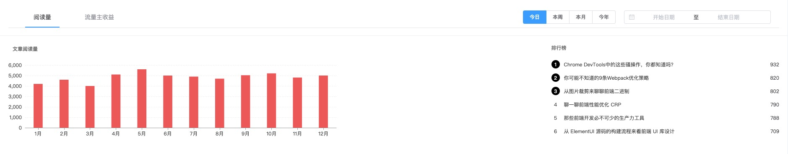

# data-report（数据报表）

<p align="center">
  <a href="https://www.npmjs.com/package/echarts">
    
  </a>
  <a href="https://www.npmjs.com/package/echarts-liquidfill">
    
  </a>
  <a href="https://www.npmjs.com/package/echarts-wordcloud">
    
  </a>
  <a href="https://www.npmjs.com/package/vue">
    
  </a>
  <a href="https://www.npmjs.com/package/element-ui">
    
  </a>
</p>

## 介绍

## Features

## 示例效果图

### 数据汇总


### 文章阅读排行



### 关键词搜索 && 文章分类


### 粉丝分布 && 热门搜索词云图


## 预览当前项目所有 demo

```
# 从 GitHub 下载后，安装依赖
npm install

# 编译代码
npm run serve

在浏览器地址栏输入：http://localhost:8080/#/

```
